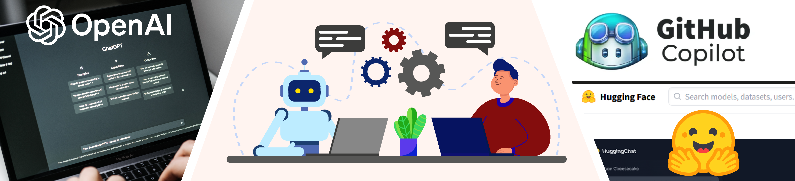

# Prompt Engineering & AI Application deployment

{width=1000}

 This work is licensed under a <a rel="license" href="http://creativecommons.org/licenses/by/4.0/">Creative Commons Attribution 4.0 International License</a>.

Welcome to our documentation on generative Artificial Intelligence (AI) prompt engineering and application integration in academic research and education.

!!! Success "Learning Objectives"

        After the lesson, you should be able to:
        
        * Explain why generative AI matters in education, research, and society
        * Create effective prompts in ChatGPT and other Transformer applications
        * Create your own AI-powered applications using Gradio
        * Understand how and when to use AI assistants 

## General Productivity Applications

The most likely interaction you will have (or have already had) with [generative AI](https://en.wikipedia.org/wiki/Generative_artificial_intelligence){target=_blank}, [Transformers](https://en.wikipedia.org/wiki/Transformer_(machine_learning_model)){target=_blank}, and [Large Language Models (LLMs)](https://en.wikipedia.org/wiki/Large_language_model){target=_blank} is with [:simple-openai: OpenAI's ChatGPT](https://chat.openai.com/){target=_blank}. 

Predictive text and auto completion are becoming more common in productivity software. Generative AI powered applications are making their way into everyday software like Word Processors, SMS text messaging, and spreadsheets. LLMs are also being released into productivity software like [Microsoft Office 365 w/ CoPilot](https://blogs.microsoft.com/blog/2023/03/16/introducing-microsoft-365-copilot-your-copilot-for-work/){target=_blank} and [Google's Docs and Sheets Workspace](https://workspace.google.com/blog/product-announcements/generative-ai){target=_blank}.

**ChatGPT**

:material-run-fast: Go to our lesson on [:simple-openai: ChatGPT Prompt Enginering](chatgpt_prompts.md)

**AI enabled search engines**

ChatGPT is integrated into Microsoft's Edge Browser via [Bing Chat](https://www.bing.com/new?form=MY0291&OCID=MY0291){target=_blank}. Google's competitor, [LaMDA](https://blog.google/technology/ai/lamda/), is featured in [Bard](https://bard.google.com/){target=_blank}. 

:material-run-fast: Go to our lesson on [:material-microsoft-edge: Edge Bing](bing.md)

:material-run-fast: Go to our lesson on [:simple-googlechrome: Bard](bard.md) 

## Research Applications

Research applications of generative AI and LLMs are broad. We obviously won't be able to teach all of them here, but hopefully this is an effective jumping off point:

**Programming**

:material-run-fast: Go to our lesson on [:octicons-copilot-48: GitHub CoPilot](github_copilot.md)

:material-run-fast: Go to our lesson on  [:simple-openai: the OpenAI API](openai_api.md)

**Applications**

:material-run-fast: Go to our lesson on  [:simple-openai: OpenAI API Powered Extensions](openai_extensions.md)

:material-run-fast: Go to our lesson on  [:hugging: HuggingFace Models](huggingface_models.md)

:material-run-fast: Go to our lesson on  [:hugging: HuggingFace Datasets](huggingface_datasets.md)

:material-run-fast: Go to our lesson on  [:hugging: Gradio UI](huggingface_gradio.md)

## Educational Applications

Thinking about integrating ChatGPT and OpenAI into your coursework?

There are already a large list of potentail uses for ChatGPT in higher education

Read about [OpenAI Educator Considerations](https://platform.openai.com/docs/chatgpt-education/educator-considerations-for-chatgpt)

??? Info "Glossary"

    [:simple-google: Google's Machine Learning Glossary](https://developers.google.com/machine-learning/glossary){target=_blank}

    [:simple-nvidia: NVIDIA's Data Science Glossary](https://www.nvidia.com/en-us/glossary){target=_blank}

    **BARD** - Google's general purpose LLM

    **Bi-directional Encoder Representations from Transformers (BERT)** - is a family of masked-language models introduced in 2018 by researchers at Google [:simple-wikipedia:](https://en.wikipedia.org/wiki/BERT_(language_model)), [(Devlin et al. :simple-arxiv:)](https://doi.org/10.48550/arXiv.1810.04805){target=_blank}

    **ChatGPT** - OpenAI's general purpose LLM

    **CoPilot** - GitHub (Microsoft/OpenAI) AI co-programmer, natively integrated as an extension in VS Code or GitHub CodeSpaces

    **Generative Pretrained Transformer (GPT)** - are a family of large language models, which was introduced in 2018 by the American artificial intelligence organization OpenAI [:simple-wikipedia:](https://en.wikipedia.org/wiki/Generative_pre-trained_transformer). [(Radford et al. :simple-arxiv:)](https://www.cs.ubc.ca/~amuham01/LING530/papers/radford2018improving.pdf){target=_blank}

    **GitHub** - the most widely used Version Control infrastructure, owned by Microsoft and natively integrated with OpenAI

    **DALL·E** - OpenAI stable diffusion image generation model
    
    **HuggingFace** - library for open source AI models and apps

    **Large Language Models (LLMs)** - is a language model consisting of a neural network with many parameters (typically billions of weights or more), trained on large quantities of unlabelled text using self-supervised learning [(:simple-wikipedia:)](https://en.wikipedia.org/wiki/Large_language_model){target=_blank}

    **Language Models for Dialog Applications (LaMDA)** - Google's general purpose LLM
    
    **Latent Diffusion Model (LDM)** [(:simple-arxiv:)](https://doi.org/10.48550/arXiv.2112.10752){target=_blank} - machine learning models designed to learn the underlying structure of a dataset by mapping it to a lower-dimensional latent space.

    **Large Language Model Meta AI (LLAMA)** - Meta's general purpose LLM

    **MidJourney** - popular image generation platform (proprietary), which is accessed via Discord

    **Neural networks** - [(:simple-wikipedia:)](https://en.wikipedia.org/wiki/Neural_network) [(:simple-google:)](https://developers.google.com/machine-learning/glossary#neural-network){target=_blank} - are similar to their biological counter parts, in the sense they have nodes which are interconnected. Rather than string-like neurons and synapses in biology, artificial networks are made of nodes connected by networks of 'weights' which can have positive or negative values.

    **OpenAI** - private company responsible for the first LLMs and ChatGPT

    **Parameter** - [(:simple-google:)](https://developers.google.com/machine-learning/glossary#parameter){target=_blank} is a value that the model can independently modify as it is trained. Parameters are derived from the training data upon which the model is trained. The number of parameters in the newest LLMs are typically counted in the billions to the trillions.

    **Segment-Anything (Meta)** - is a recently released image and video segmentation technology that allows you to 'clip' a feature from an image with a single click. 

    **Stable Diffusion** - computer vision models for creating images from text

    **Tuning** - the process of refining models to become more accurate

    **Weights** - are the value by which a model multiplies another value. Weights are typically determined by the proportional value of the importance of the parameters. Weights signify the value of a specific set of parameters after self-training.

    **Zero-shot** - learning where the AI observes samples from classes which were not observed during training, and needs to predict the class that they belong to. 
