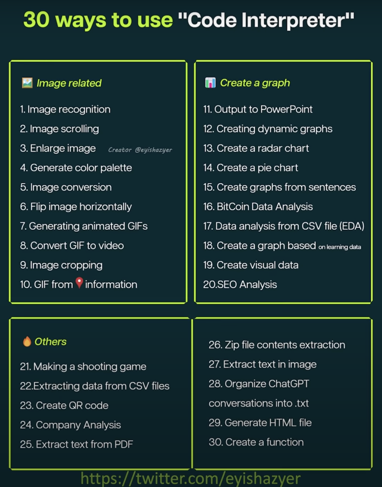
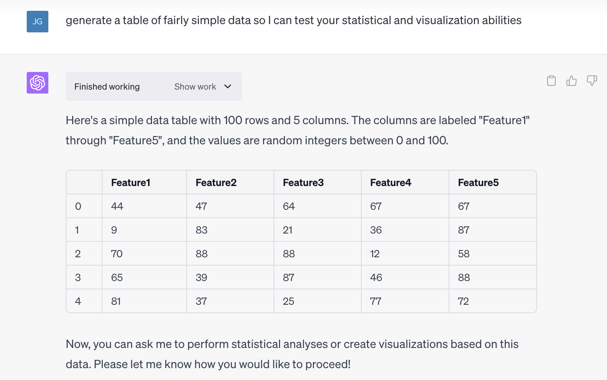
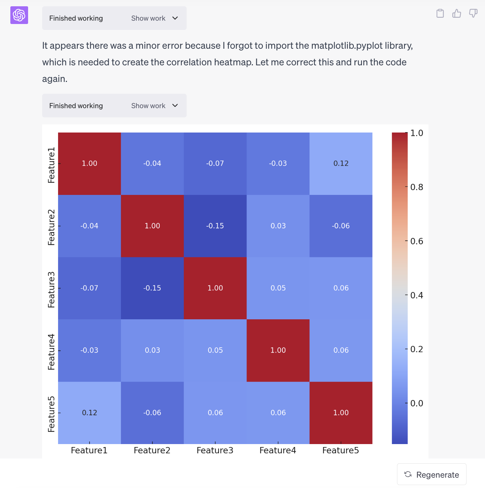
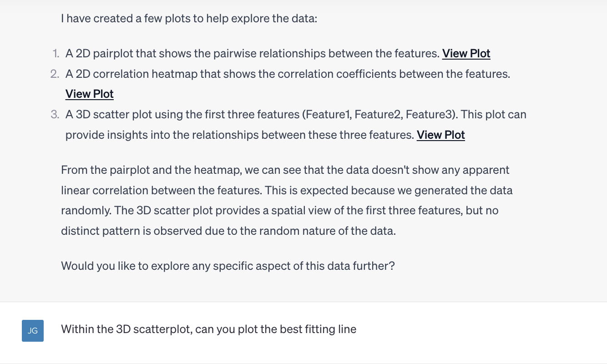
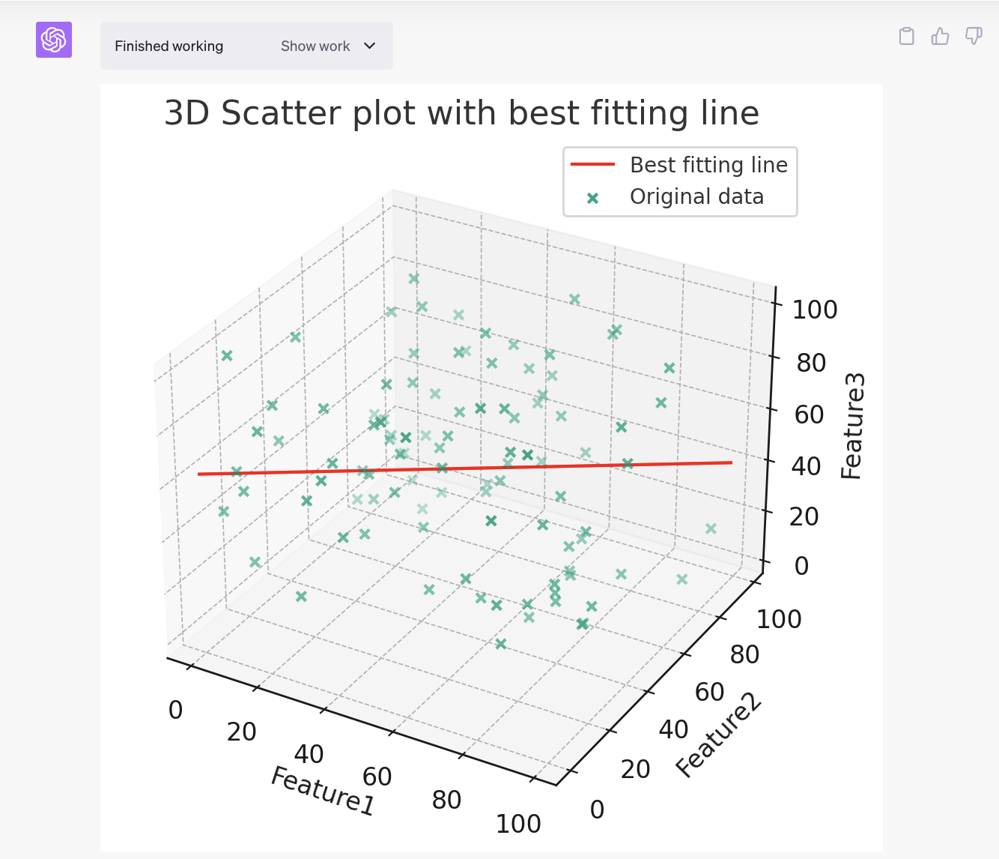
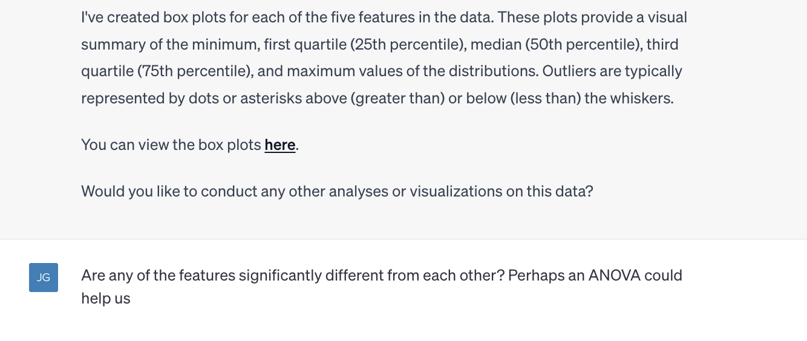

## Third-Party Plugins

ChatGPT [Plugins](https://openai.com/blog/chatgpt-plugins){target=_blank} are in Beta release and available for chatGPT Plus subscribers.

Plugins are a way to extend the functionality of ChatGPT. They are tools that chatGPT can use and usually involve interacting with a live website or third-party application. Plugins are available directly in the chatGPT interface. To use them, users need to activate them first. Please watch the gif below to see how to activate a plugin.

??? Tip "Enable Plugins and Code Interpreter"

    <figure markdown>
    { width="600" }
    <figcaption> Enable Plugin and Code Interpreter</figcaption>
    </figure>

There are already hundreds of plugins available to use within the chatGPT interface. For example, if you enable the Expedia plugin, you can search for flights, hotels, and anything else that Expedia does, and do it all within the chatGPT interface. 

Using the 'ScholarAI' plugin, you can search for academic papers and have them summarized for you. Currently, it only connects to Springer-Nature articles. 

Another plugin is called 'Video Insights'. With this plugin enabled, you can give chatGPT  links to videos on the web and it can provide you a summary of the video and write out the transcript.

Check out these youtubers and their recommendations for the plugins. 

<iframe width="500" height="300" src="https://www.youtube.com/embed/XbkBjdwwyJA" title="I tried ALL ChatGPT PLUGINS and here&#39;s the best!" frameborder="0" allow="accelerometer; autoplay; clipboard-write; encrypted-media; gyroscope; picture-in-picture; web-share" allowfullscreen></iframe>

<iframe width="500" height="300" src="https://www.youtube.com/embed/3GDf9xArVJw" title="ChatGPT Plugins: Are They Really Helping Researchers or Just Hype?" frameborder="0" allow="accelerometer; autoplay; clipboard-write; encrypted-media; gyroscope; picture-in-picture; web-share" allowfullscreen></iframe>

## Code Interpreter

[Code Interpreter](https://openai.com/blog/chatgpt-plugins#code-interpreter{target=_blank}) is a plugin developed in-house at OpenAI. It allows you to upload files within the chat and ask the chatbot to analyze it. Currenty, you can upload spreadsheets, images, text documents, and code. When you ask the bot to do something, it will write python code and then actually execute the code within the chat. 

For scientists, Code Interpreter is going to be a game changer. You can upload tables of data to chatGPT and it can do all kinds of statisical analyis and visualizations with simple natural language prompts. 

File size upload limit of 50 mb

You can ask it to create and edit spreadsheet table, do mathematics. 

You can ask it to create a visual word cloud of the document. 
I asked it to create a histogram of the most common words in the document.

- `.py`: Python scripts
- `.txt`: Text files
- `.csv`: Comma-separated values (CSV) files
- `.json`: JavaScript Object Notation (JSON) files
- `.xls`, `.xlsx`: Excel files
- `.pkl`: Pickle files
- `.h5`: Hierarchical Data Format (HDF) files
- `.jpg`, `.png`, etc.: Various image formats
- `.mp3`, `.wav`, etc.: Various audio formats

<figure markdown>
{ width="350" }
<figcaption></figcaption>
</figure>

From this [Youtube Video](https://www.youtube.com/watch?v=FF_HzfqxS2o)

??? Tip "A Simple Data Analysis Conversation with Code Interpreter"
  
    {width=600}
    {width=600}
    {width=600}
    {width=600}
    {width=600}
    {width=600}
    {width=600}
    {width=600}
    {width=600}

## BARD Capabilities

Since BARD is connected to the internet, you can give it a link to a research paper and it will read it and answer question based on it. 

When I upload an image, Bard does an impressive job of describing what is in the image. chatGPT cannot do that I think. 

