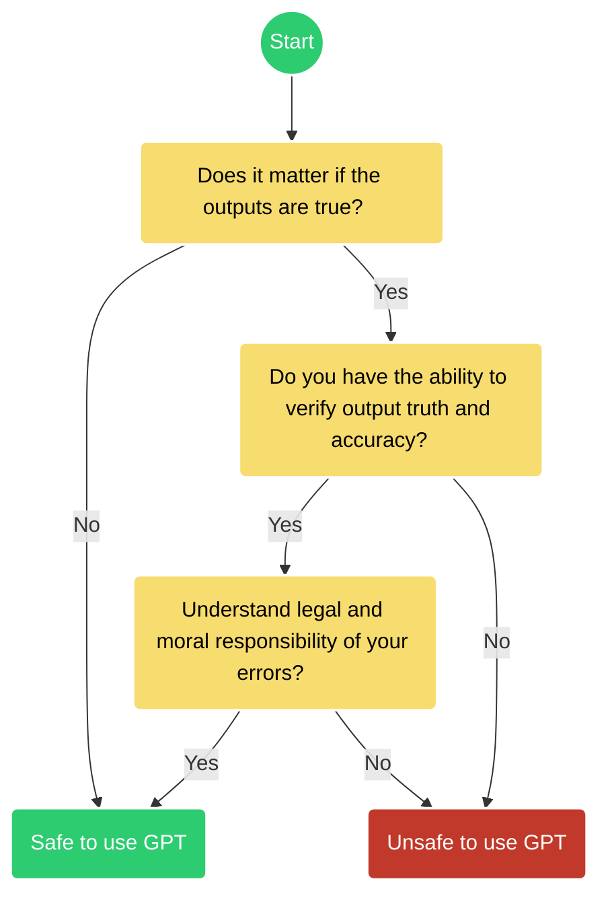

# Ethics of using AI

 This work is licensed under a <a rel="license" href="http://creativecommons.org/licenses/by/4.0/">Creative Commons Attribution 4.0 International License</a>.

 **When can you use a GPT for research and education?**

Figure credit, based on: :fontawesome-brands-creative-commons-by: [ChatGPT and Artificial Intelligence in Education, UNESCO 2023 :fontawesome-regular-file-pdf:](https://www.iesalc.unesco.org/wp-content/uploads/2023/04/ChatGPT-and-Artificial-Intelligence-in-higher-education-Quick-Start-guide_EN_FINAL.pdf){target=_blank}

  
## Controversy

 The last six months has seen a rash of cases around the mis-use and illegal applications of GPTs and LLMs.

There are [deep ethical concerns about the use of AI](https://www.sciencefriday.com/segments/ai-open-letter-chatgpt-ethics/){target=_blank} like GPT and LLMs, particularly concerning their training data.

ChatGPT has effectively gamified higher education, is biased, can lie, and is being used to spread disinformation and hate speech. It also effectively steals designs, visual art, and music styles. 

[European Union's proposed AI Act legislation](https://www.cnbc.com/2023/05/15/eu-ai-act-europe-takes-aim-at-chatgpt-with-landmark-regulation.html){target=_blank}

[Class Action: GitHub CoPilot trained on private repositories](https://githubcopilotlitigation.com/){target=_blank}

[MidJourney and Dall-E using trademarked imagery and art](https://www.artnews.com/art-in-america/features/midjourney-ai-art-image-generators-lawsuit-1234665579/){target=_blank}

[A lawyer submits a legal brief written by ChatGPT and is caught](https://www.nytimes.com/2023/05/27/nyregion/avianca-airline-lawsuit-chatgpt.html){target=_blank}

[College students using ChatGPT](https://ethicspolicy.unc.edu/news/2023/04/17/the-ethics-of-college-students-using-chatgpt/){target=_blank}

[Prompt Injection Attacks](https://www.wired.com/story/chatgpt-prompt-injection-attack-security/){target=_blank}

!!! Tip "Ethics of Artificial Intelligence"

    * [The Asilomar AI Principles (2017)](https://futureoflife.org/open-letter/ai-principles/){target=_blank}
    
    * [A Unified Framework of Five Principles for AI in Society](https://doi.org/10.1162%2F99608f92.8cd550d1){target=_blank}
    
    * [Ethics of Artificial Intelligence (:simple-wikipedia:)](https://en.wikipedia.org/wiki/Ethics_of_artificial_intelligence){target=_blank}